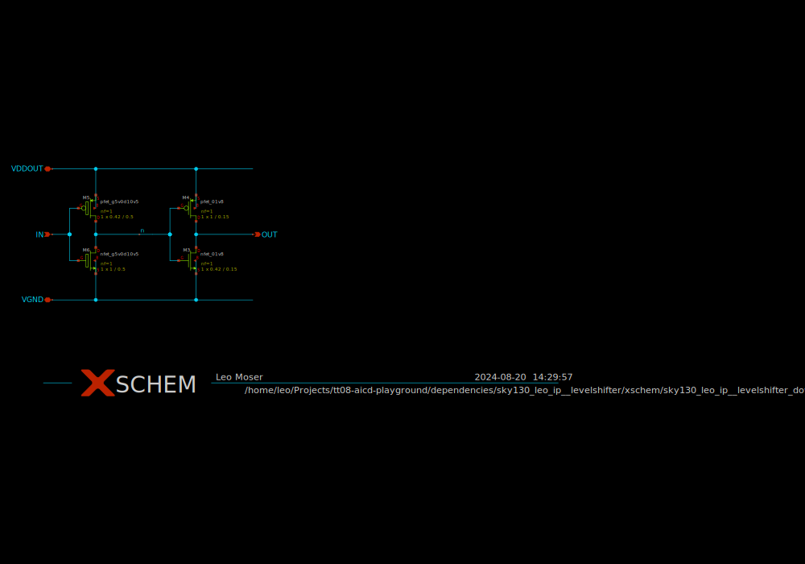

# sky130_leo_ip__levelshifter_down

- Description: A simple levelshifter intended for 3.3V to 1.8V
- PDK: sky130A

## Authorship

- Designer: Leo Moser
- Created: July 29, 2024
- License: Apache 2.0
- Company: None
- Last modified: None

## Pins

- VGND
  + Description: Ground
  + Type: ground
  + Direction: inout
- VDDOUT
  + Description: High Voltage
  + Type: supply
  + Direction: inout
- IN
  + Description: Input
  + Type: signal
  + Direction: input
- OUT
  + Description: Output
  + Type: signal
  + Direction: output

## Default Conditions

- vddin
  + Description: Input low voltage
  + Display: Vddin
  + Unit: V
  + Typical: 1.8
- vddout
  + Description: Output high voltage
  + Display: Vddout
  + Unit: V
  + Typical: 3.3
- cl
  + Description: Output load capacitance
  + Display: CLoad
  + Unit: fF
  + Maximum: 10
- corner
  + Description: Process corner
  + Display: Corner
  + Typical: tt
- temperature
  + Description: Ambient temperature
  + Display: Temp
  + Unit: °C
  + Typical: 27

## Symbol

## Schematic

## Layout

