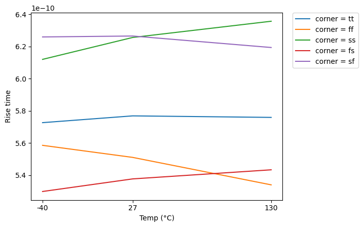
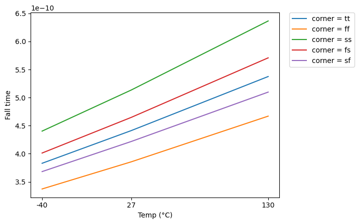

# CACE Summary for sky130_leo_ip__levelshifter_down

**netlist source**: rcx

|      Parameter       |         Tool         |     Result      | Min Limit  |  Min Value   | Typ Target |  Typ Value   | Max Limit  |  Max Value   |  Status  |
| :------------------- | :------------------- | :-------------- | ---------: | -----------: | ---------: | -----------: | ---------: | -----------: | :------: |
| Rise time            | ngspice              | rise                 |             any |   0.530 ns |          any |   0.576 ns |          any |   0.636 ns |   Pass ✅    |
| Fall time            | ngspice              | fall                 |             any |   0.337 ns |          any |   0.441 ns |          any |   0.637 ns |   Pass ✅    |
| Area                 | magic_area           | area                 |               ​ |          ​ |            ​ |          ​ |          any | 25.379 µm² |   Pass ✅    |
| Width                | magic_area           | width                |               ​ |          ​ |            ​ |          ​ |          any |   7.210 µm |   Pass ✅    |
| Height               | magic_area           | height               |               ​ |          ​ |            ​ |          ​ |          any |   3.520 µm |   Pass ✅    |
| Magic DRC            | magic_drc            | drc_errors           |               ​ |          ​ |            ​ |          ​ |            0 |          0 |   Pass ✅    |
| Netgen LVS           | netgen_lvs           | lvs_errors           |               ​ |          ​ |            ​ |          ​ |            0 |          0 |   Pass ✅    |
| KLayout DRC feol     | klayout_drc          | drc_errors           |               ​ |          ​ |            ​ |          ​ |            0 |          0 |   Pass ✅    |
| KLayout DRC beol     | klayout_drc          | drc_errors           |               ​ |          ​ |            ​ |          ​ |            0 |          0 |   Pass ✅    |
| KLayout DRC full     | klayout_drc          | drc_errors           |               ​ |          ​ |            ​ |          ​ |            0 |          0 |   Pass ✅    |

## Plots

## rise_vs_temp

## fall_vs_temp

